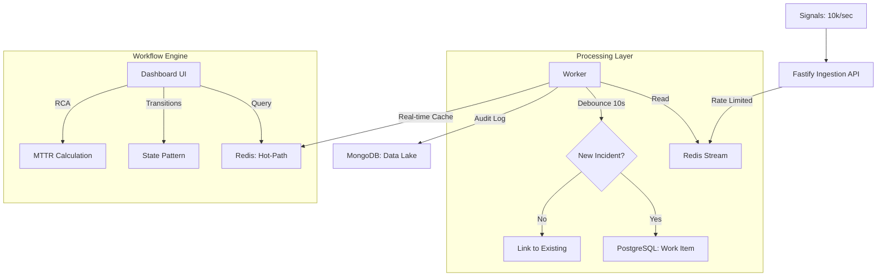

# Mission-Critical Incident Management System (IMS)

A resilient, high-throughput system designed to monitor complex distributed stacks and manage failure mediation workflows.

## 🏗️ Technical Architecture



## 🚀 Key Features

- **High-Throughput Ingestion**: Supports bursts of up to 10,000 signals/sec using Redis Streams for backpressure management.
- **Intelligent Debouncing**: Consolidates 100+ signals from the same component within 10s into a single Work Item.
- **Design Patterns**:
    - **Strategy Pattern**: Decouples alerting logic for different component types (DB vs Cache).
    - **State Pattern**: Manages the incident lifecycle (`OPEN` -> `INVESTIGATING` -> `RESOLVED` -> `CLOSED`) with mandatory RCA validation.
- **Data Handling**:
    - **MongoDB**: Acts as the Data Lake for high-volume raw signal audit logs.
    - **PostgreSQL**: Stores structured, transactional Work Items and RCA records.
    - **Redis**: Maintains the "Hot-Path" for sub-millisecond dashboard refreshes.
- **Premium Dashboard**: Glassmorphism UI with real-time updates and deep-dive signal analysis.

## 🛠️ Setup Instructions

### Prerequisites
- Docker & Docker Compose
- Node.js (v18+)

### 1. Start the Infrastructure
```bash
docker-compose up -d
```

### 2. Start the Backend
```bash
cd backend
npm install
# Start API Server
npm run start
# In a separate terminal, start the Worker
npm run worker
```

### 3. Start the Frontend
```bash
cd frontend
npm install
npm run dev
```

### 4. Simulate Signals
```bash
cd scripts
node mock-signals.js
```

## 📈 Backpressure Handling
The system handles backpressure by separating the **Ingestion API** from the **Persistence Layer**. Signals are immediately buffered into a **Redis Stream**. If the databases (Postgres/Mongo) become slow, the stream acts as a resilient queue, preventing the API from crashing or losing data. The Background Worker consumes signals at a rate the storage layer can handle.

## 🛡️ RCA Validation
The system enforces a mandatory Root Cause Analysis (RCA) before an incident can be transitioned to the `CLOSED` state. MTTR (Mean Time To Repair) is automatically calculated upon RCA submission.

## 🧪 Resilience & Testing
- **Unit Testing**: Core business logic (State Pattern, MTTR calculation, RCA validation) is covered by Jest unit tests.
- **Database Resilience**: All database writes (Postgres & MongoDB) use an **Exponential Backoff Retry** mechanism to handle transient failures.
- **Observability**: Real-time throughput metrics are printed to the console every 5 seconds.

## 🌟 Bonus Features (Non-Functional)
- **Security Layer**: 
    - Implemented **Fastify Helmet** for secure HTTP headers.
    - **CORS** enabled for frontend-backend isolation.
    - **Rate Limiting** applied to the ingestion API to prevent DDoS and cascading failures.
- **High Performance**:
    - Uses **Fastify**, the fastest Node.js framework.
    - **Redis Streams** for sub-millisecond ingestion buffering.
    - **Hot-Path Caching** (Redis) to avoid heavy DB queries during dashboard refreshes.
- **Schema Validation**: All signals and Work Items are strictly typed and validated.

## 📝 Development Documentation
A detailed [DEVELOPMENT_LOG.md](./DEVELOPMENT_LOG.md) is included, covering architectural decisions, design patterns, and the build process as per the assignment requirements.

---
*Developed as a Mission-Critical Engineering Challenge.*
